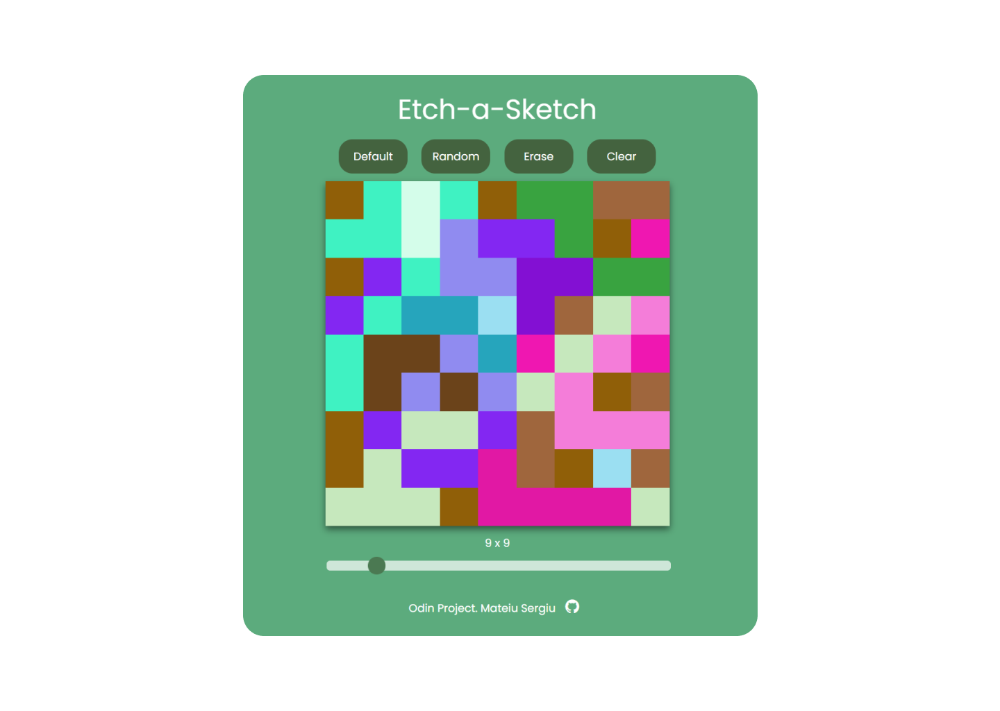

# Etch-a-Sketch

## This project is part of the 'The Odin Project' curriculum.
### Live Demo: https://serh1.github.io/etch-a-sketch/
- The project is illustrating facilities of JavaScript DOM.
- Generating the grid using DOM functions in a for loop

  ```sh
    const cell = document.createElement('div');
    container.appendChild(cell);
  ```
- Posibility to change the grid size using the slider.

### Buttons:
  - Default: Set color to Black;
  - Random: Set a random color;
  - Erase: Erase tool;
  - Clear: Clear the grid;


